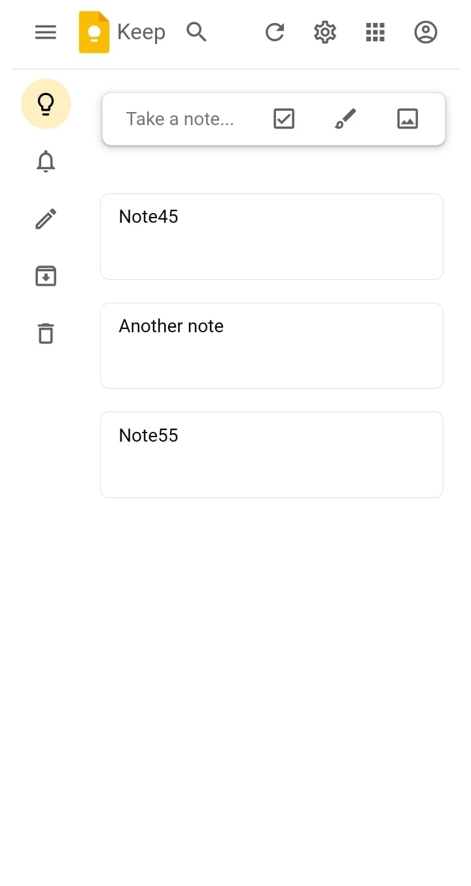

# Google Keep Clone

> Make a note , save it, edit and/or delete it. Fullstack App

---

### Table of Contents

- [Description](#description)
- [Reference(s)](#references)
- [Developer Info](#developer-info)

---

## Description

This is my Google Keep clone , I Used HTML, CSS , JAVASCRIPT , OOP , DOM & Firebase to execute it. You're able to write a note, edit it , delete it and all of the notes are saved in the firebase database which enables to store the notes for each user. There's also an authentication process/step so that each user has their own set of notes, their information is also stored in the firebase database, so you can sign in with your credentials and be able to view your own notes with your user name at the top of the app, viewable when signed in. It is also mobile responsive, basically a fullstack application.

#### Language(s) / Baas:

- Firebase
- Javascript
- OOP
- DOM
- HTML
- CSS

[Back To The Top](#google-keep-clone)

---

## Reference(s)

- Fullstack Google Keep - [Google Keeep Clone](https://google-keep-firebase-fullstack.netlify.app/)

[Back To The Top](#google-keep-clone)

---

## Developer Info

- Portfolio - [Nkanyiso's Portfolio](https://nkanyiso-portfolio.netlify.app/)

[Back To The Top](#google-keep-clone)
